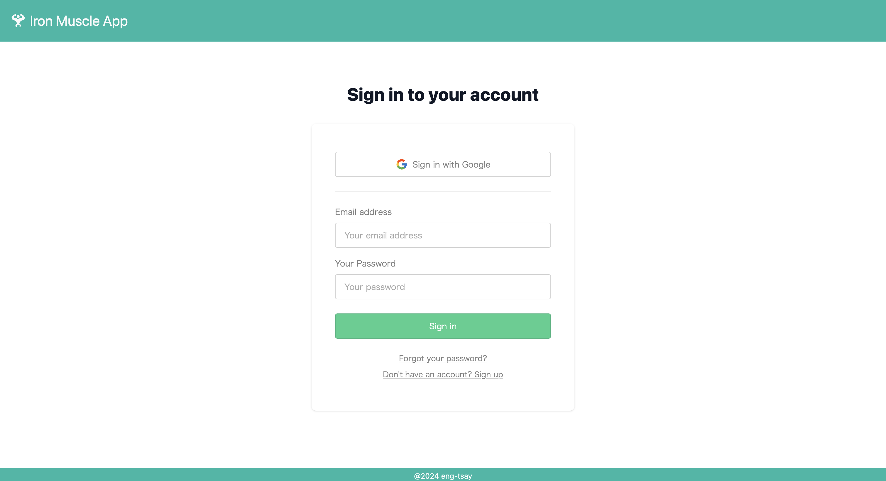
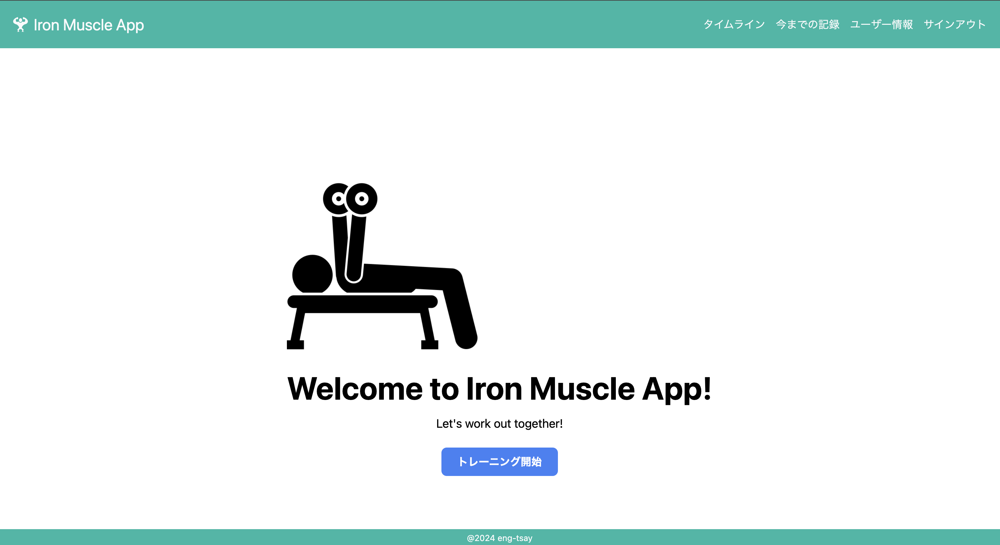
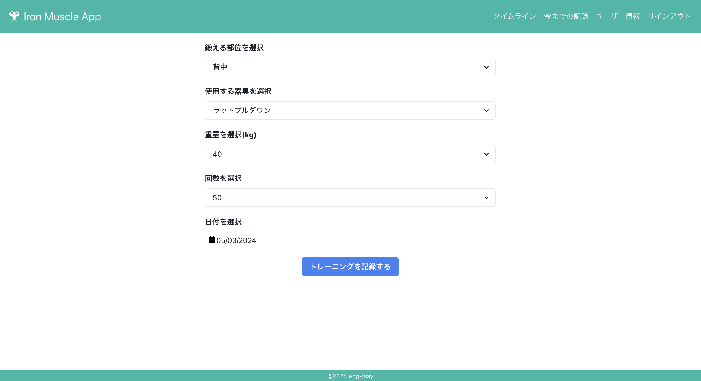
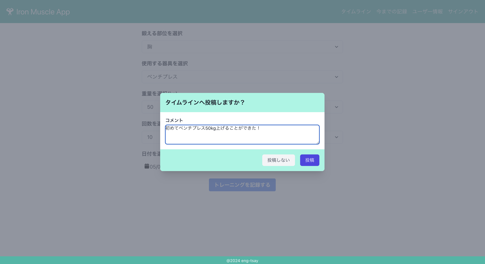
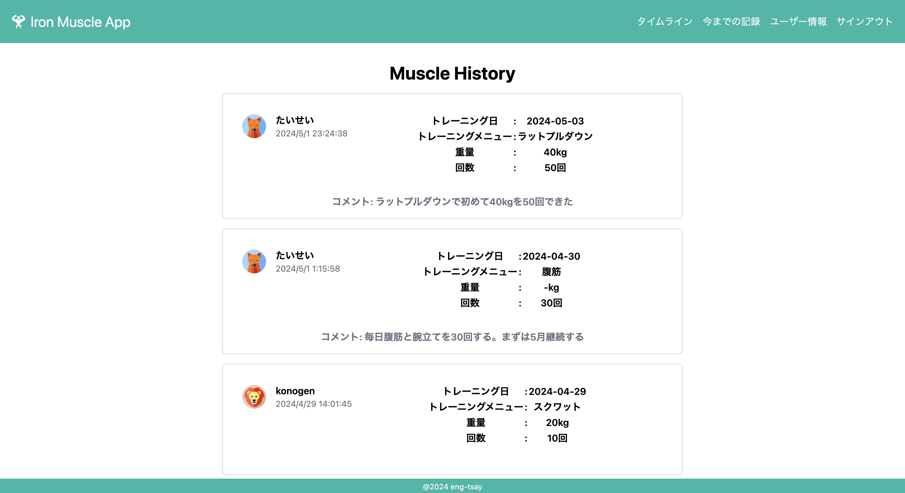
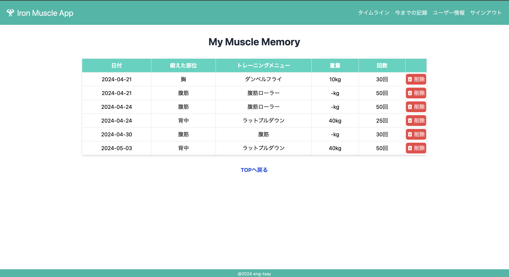
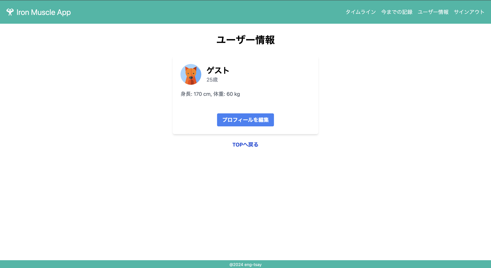
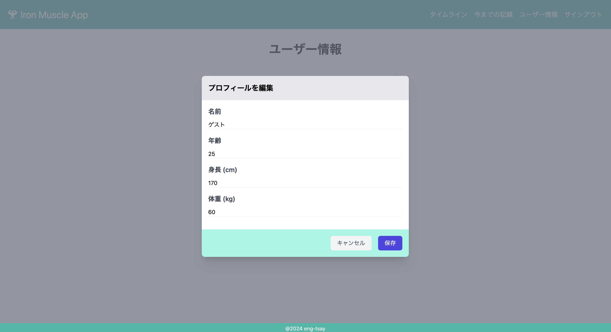

# Iron Muscle App(筋トレ記録アプリ)

## 概要

"Iron Muscle App"は、筋トレのトレーニング情報を記録、共有できる Web アプリケーションです

## 技術的なアピールポイント

- **モダンなフロントエンドフレームワークの利用**  
  React、Next.js を採用し、高速なパフォーマンスとユーザーエクスペリエンスの向上を実現

- **レスポンシブデザインとモバイル対応**  
  様々なデバイスで快適に利用できるレスポンシブデザインの採用

- **セキュアな認証とデータ管理**  
  Supabase を使用して、ユーザーアカウントの認証やデータの暗号化、セキュリティの強化を実現

- **シンプルかつ使いやすい UI と UX デザイン**  
  シンプルな UI デザインと使いやすい UX を実現し、ユーザーがストレスなくアプリを利用できるように設計

- **コミュニティと共有機能の導入**  
  タイムライン機能を通じてユーザー同士がトレーニング情報を共有し、コミュニティを形成する。

- **迅速な開発と柔軟な拡張性**  
  TypeScript を活用して、迅速な開発とコードの保守性、拡張性を高める。

## デモ画面

登録したメールアドレス、パスワードにてログインします 
より簡単にログインできるように Google 認証機能も実装しています 
※アカウント登録していない方は Sign up(アカウントの新規登録)をお願いします 
 

トレーニング開始ボタンを押して、トレーニングの記録を開始してください 
 

トレーニング情報を選択して、トレーニングを記録するボタンを押してください 
 

トレーニング情報をタイムラインに追加するかを選択し、必要に応じてコメントを記載してください 
 

他の人が投稿したトレーニング情報を閲覧することができます 
 

自分の今までのトレーニング情報を確認することができます 
 

自分のプロフィール情報を確認、編集することができます 
 

Iron Muscle App はスマホ表示にも対応しています 

## 機能一覧

- ログイン認証機能
- トレーニング情報の記録
- トレーニング履歴の閲覧
- タイムライン機能

## 開発の背景

[Iron Muscle App](https://muscle-memory-avr0mvrzg-kounotis-projects.vercel.app/)は、個人のトレーニング記録を効果的に管理するためのツールとして生まれました。 
日々のトレーニングを記録し、進捗を確認することで、ユーザーのモチベーションを向上させることを目指しています。 
さらに、他のユーザーのトレーニング履歴を閲覧できるタイムライン機能を追加することで、ユーザー同士が刺激を受け合い、共に成長するコミュニティを形成することを目指しています。

## 使用技術

- React: 18
- Next.js: 14.1.1
- React Datepicker: 6.2.0
- React Icons: 5.0.1
- React Modal: 3.16.1
- tailwindcss: 3.4.1
- Chakra UI: 2.8.2
- Supabase JS: 2.39.7
- TypeScript: 5.4.3

## 参考資料

- [React 公式ドキュメント](https://ja.react.dev)
- [Next.js 公式ドキュメント](https://nextjs.org/docs)
- [Supabase ドキュメント](https://supabase.io/docs)
