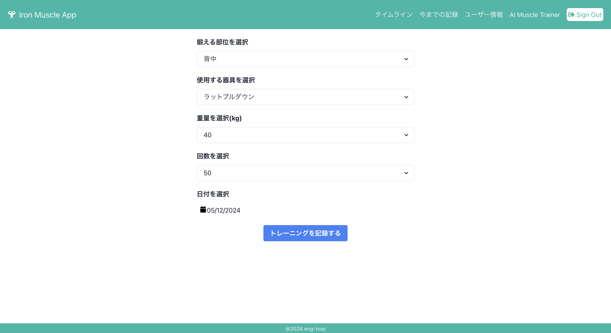
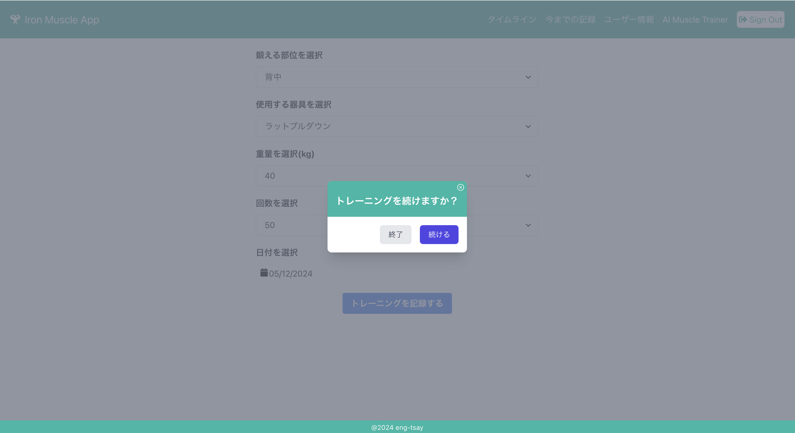
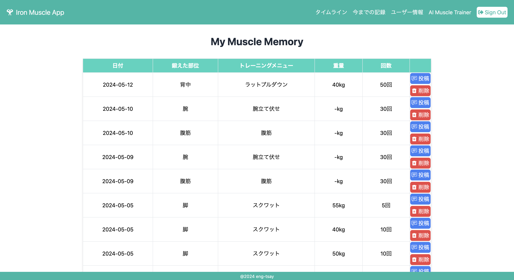
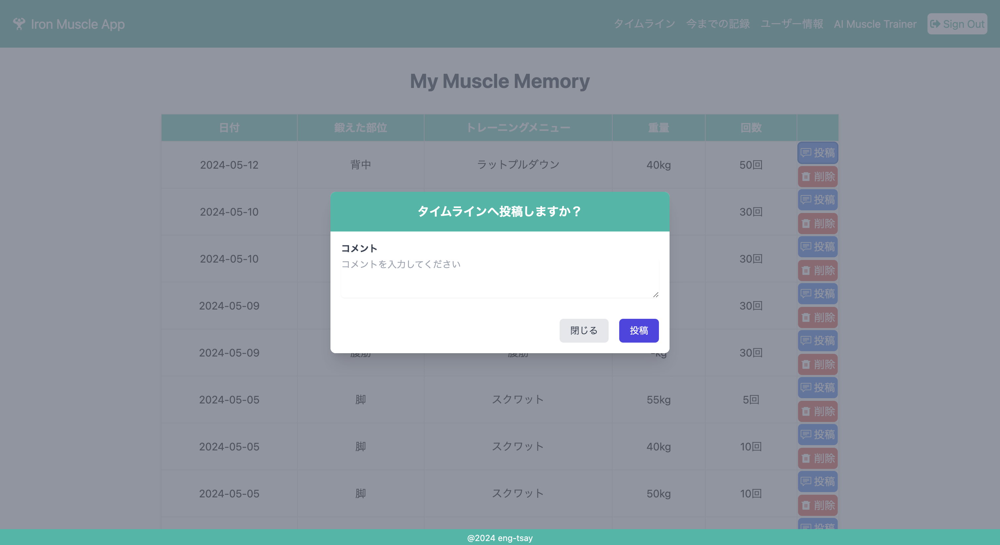
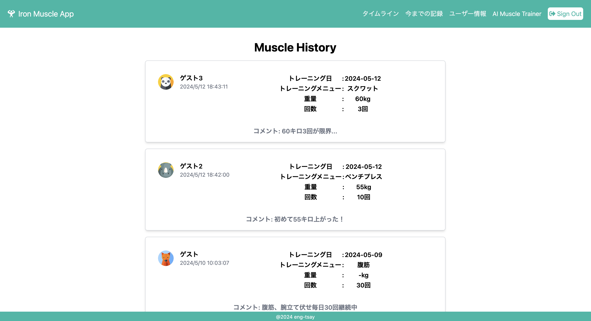
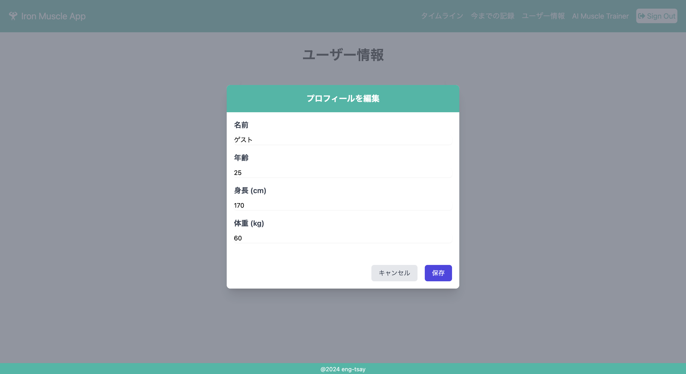
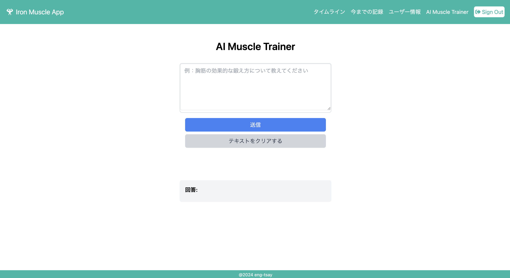
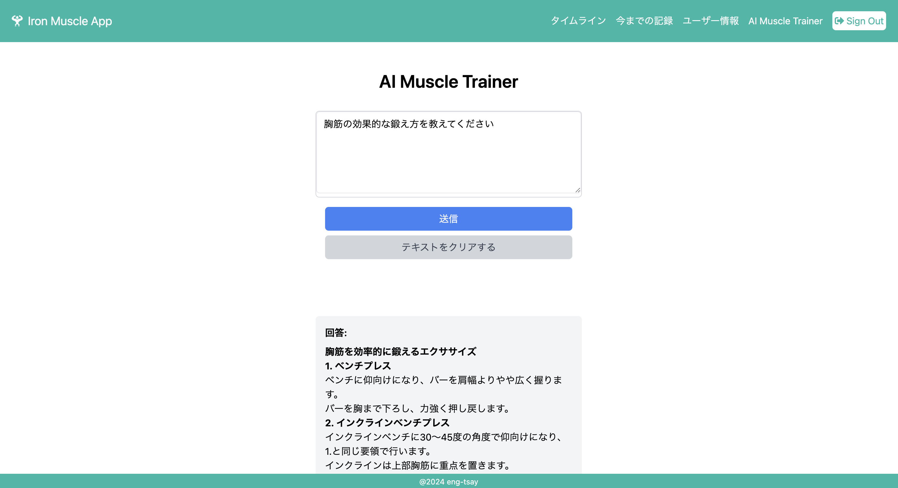
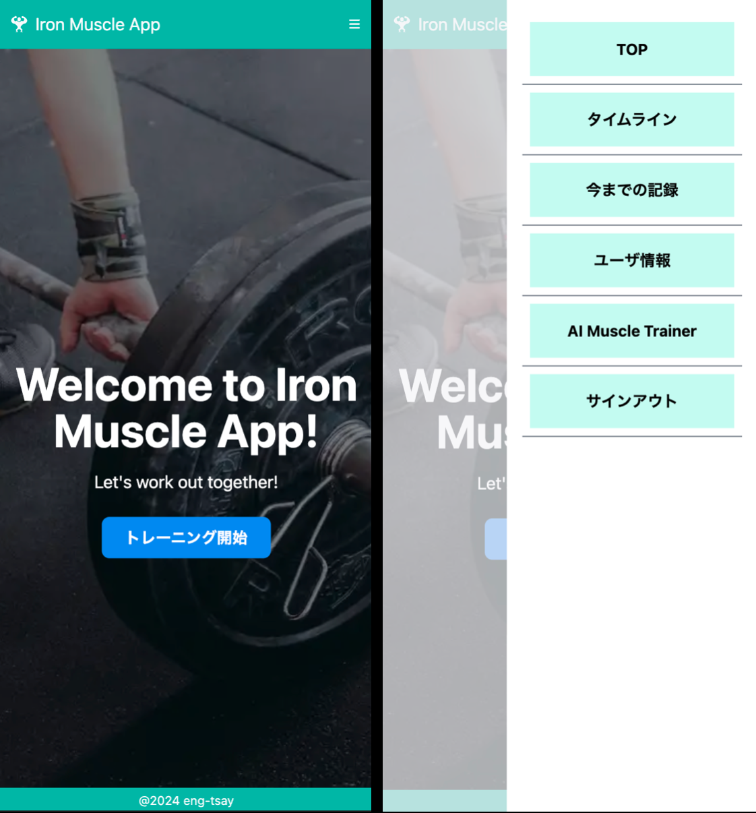

# Iron Muscle App

## 概要

"Iron Muscle App"は、筋トレを始めたばかりでトレーニング方法に迷っている人や、
筋トレのモチベーションを保つのが難しいと感じている人に向けたアプリです。 

## デモ画面

登録したメールアドレス、パスワードにてログインします 
より簡単にログインできるように Google 認証機能も実装しています 
※アカウント登録していない方は Sign up(アカウントの新規登録)をお願いします 
 

トレーニング開始ボタンを押して、トレーニングの記録を開始してください 
 

トレーニング情報を選択して、トレーニングを記録するボタンを押してください 
 

<!-- 
トレーニングを記録するボタンを押下後、トレーニングをこのまま続けるか、トレーニング終了するかを選択します 
  -->

自分の今までのトレーニング情報(My Muscle Memory)を確認することができます 
 

トレーニング情報(My Muscle Memory)ページの投稿ボタンを押すと、トレーニング情報をタイムラインへ投稿することができます 
必要に応じてコメントも記載してください 
 

タイムライン画面では他の人が投稿したトレーニング情報を閲覧することができます 
 

自分のプロフィール情報を確認、編集することができます 
 

AI Muscle Trainer では、トレーニングや健康に関する質問に AI が答えます。 
例を参考に質問してください 
 

Iron Muscle App はスマホ表示にも対応しています 

## 技術的なアピールポイント

- **モダンなフロントエンドフレームワークの利用**  
  React、Next.js を採用し、高速なパフォーマンスとユーザーエクスペリエンスの向上を実現

- **レスポンシブデザインとモバイル対応**  
  様々なデバイスで快適に利用できるレスポンシブデザインの採用

- **セキュアな認証とデータ管理**  
  Supabase を使用して、ユーザーアカウントの認証やデータの暗号化、セキュリティの強化を実現

- **シンプルかつ使いやすい UI と UX デザイン**  
  シンプルな UI デザインと使いやすい UX を実現し、ユーザーがストレスなくアプリを利用できるように設計

- **コミュニティと共有機能の導入**  
  タイムライン機能を通じてユーザー同士がトレーニング情報を共有し、コミュニティを形成する。

- **迅速な開発と柔軟な拡張性**  
  TypeScript を活用して、迅速な開発とコードの保守性、拡張性を高める。

- **AI Muscle Trainer の導入**  
  AI Muscle Trainer は、トレーニングや適切な鍛え方に関する質問に答える機能です。ユーザーが質問すると、AI が適切な回答を提供します。

## 機能一覧

- ログイン認証機能
- トレーニング情報の記録
- トレーニング履歴の閲覧
- タイムライン機能
- AI 回答機能

## 開発の背景

[Iron Muscle App](https://ironmuscleapp.vercel.app/)は、個人のトレーニング記録を効果的に管理するためのツールとして生まれました。 
他のユーザーのトレーニング履歴を閲覧できるタイムライン機能を追加することで、ユーザー同士が刺激を受け合い、共に成長するコミュニティを形成することを目指しています。 
さらに、AI トレーナー 機能を追加することで、ユーザーがより効果的なトレーニングや健康管理を行うためのアドバイスを提供し、ユーザーの利便性と満足度を向上させることを目指しています。 

## 使用技術

- React: 18
- Next.js: 14.1.1
- React Datepicker: 6.2.0
- React Icons: 5.0.1
- React Modal: 3.16.1
- tailwindcss: 3.4.1
- Chakra UI: 2.8.2
- Supabase JS: 2.39.7
- TypeScript: 5.4.3
- generative-ai: 0.11.0

## 参考資料

- [React 公式ドキュメント](https://ja.react.dev)
- [Next.js 公式ドキュメント](https://nextjs.org/docs)
- [Supabase ドキュメント](https://supabase.io/docs)
